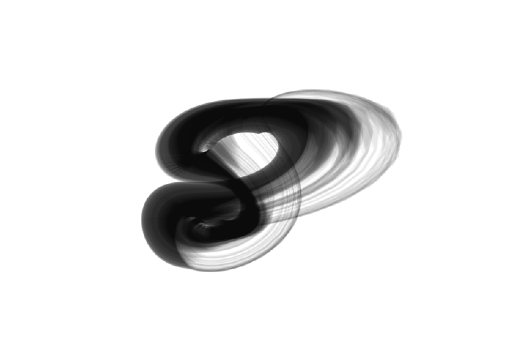
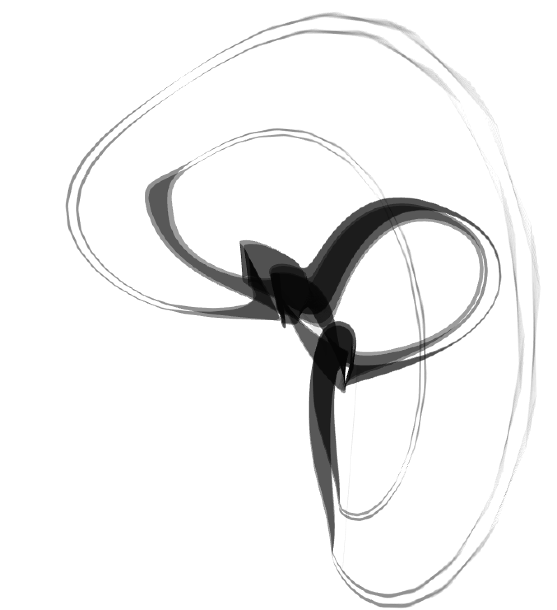
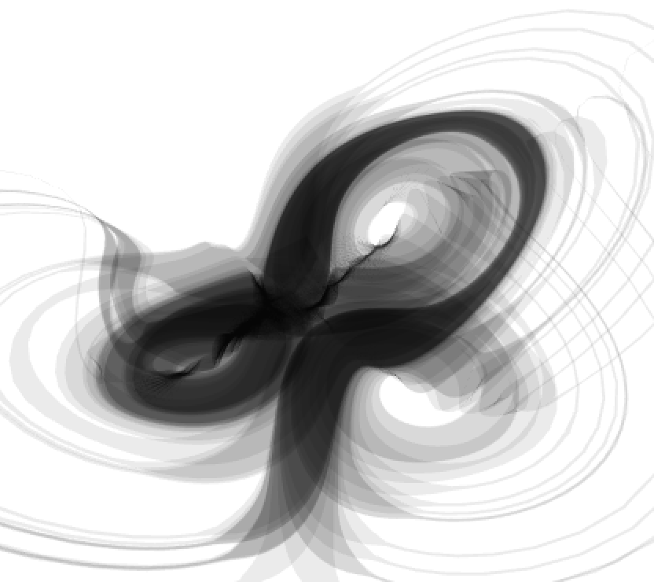
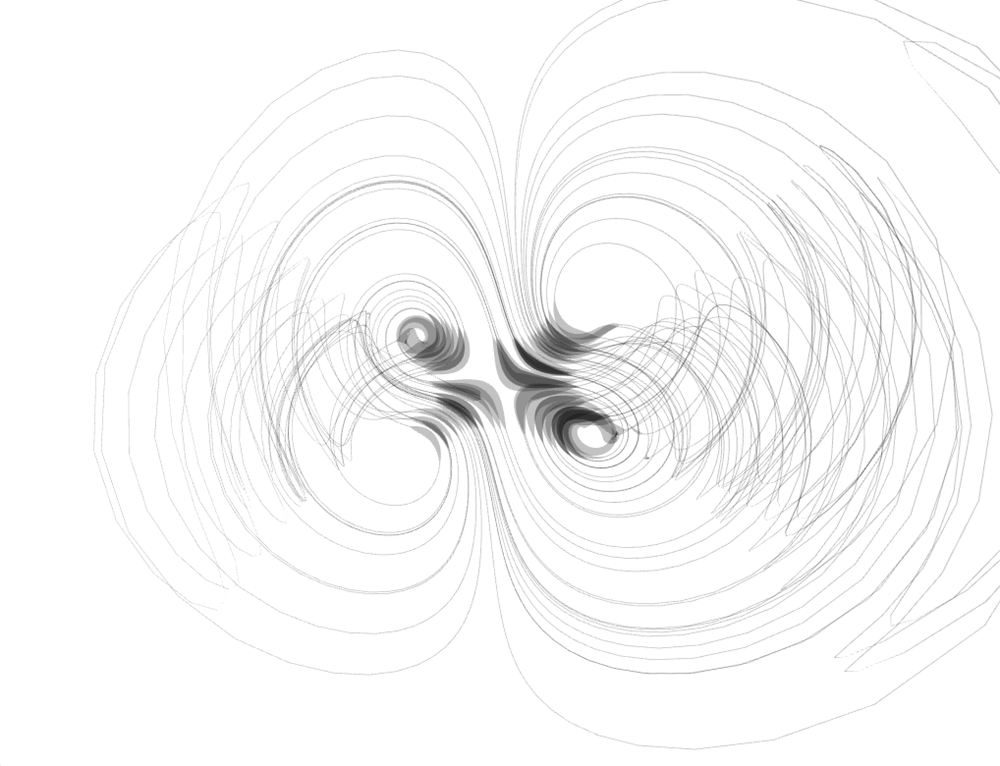
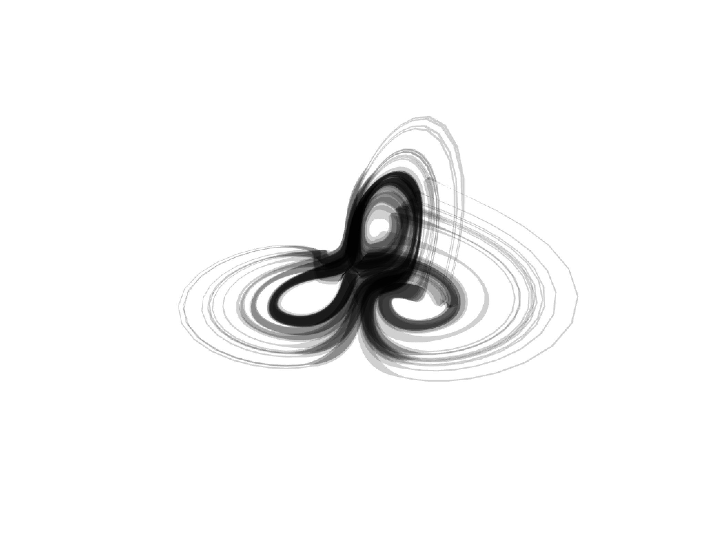
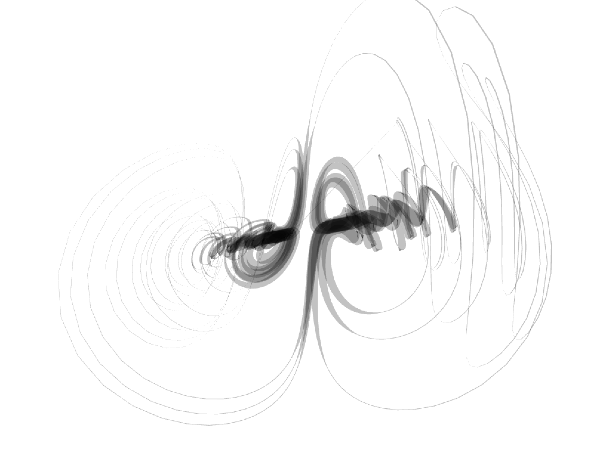

# dadras

<p align="center">
  
  
  
</p>
<p align="center">
  
  
  
</p>

A real-time chaotic attractor visualizer and audio synthesizer built with [openFrameworks](https://openframeworks.cc/) v0.12.0.

The attractor's state drives two things simultaneously: a 3D ribbon mesh rendered from the trajectory, and stereo audio output derived from the x/y/z coordinates. Each attractor also has a small MLP neural network that can learn to map mouse position to attractor parameters.

## Requirements

- macOS 10.15+
- openFrameworks v0.12.0 at `../../..` relative to this directory
- clang++ from LLVM 17 (`/opt/homebrew/Cellar/llvm/17.0.6_1/bin/`)

## Build

```bash
make          # debug
make Release  # release
make clean

bin/dadras    # run after building
```

An Xcode project (`dadras.xcodeproj`) is also included with Debug and Release schemes.

## Controls

**Presets** (per attractor, stored in `bin/data/<attractor>_presets.json`):

| Key | Action |
|-----|--------|
| `0`-`9` | Lerp to preset slot |
| `Ctrl+0`-`9` | Save current state to slot |
| `Shift+0`-`9` | Jump immediately to slot |
| `s` | Save presets to JSON |
| `l` | Load presets from JSON |

**Other:**

| Key | Action |
|-----|--------|
| `\` | Toggle GUI visibility |

## Neural Network

Using a technique popularised by the [flucoma](https://learn.flucoma.org/learn/regression-neural-network/) project, we use an XY pad to traverse between some saved states of the attractor. Each attractor owns a two-layer MLP (via [genann](https://github.com/codeplea/genann)) and learns a non-linear mapping between the 2D coordianates and the attractor parameters.

Workflow:
1. Move the mouse to a position, set parameters as desired, press **Capture**
2. Repeat for several XY and attractor positions
3. Press **Train** (runs N cycles at the configured learning rate)
4. Enable the **Predict** toggle — mouse position now controls parameters

Training data is per-attractor and held in memory only; presets handle persistence.

## Attractors

Three attractors are currently implemented:

- **Dadras** — 5 parameters (a, b, c, d, r)
- **Thomas** — 1 parameter (b), cyclically symmetric
- **CoupledLorenz** — coupled Lorenz system

